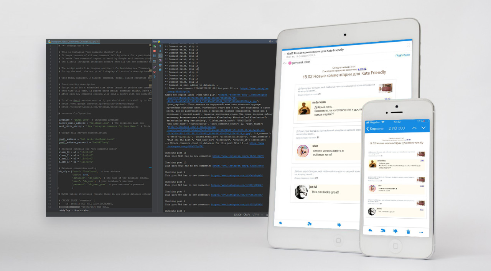

# Instagram-new-comments-checker

The script keeps records of all new comments left by others for a particular user (no authentication needed).
It sends "new comments" report to email by Google mail service (authentication needed).
The classic Instagram interface doesn't show all the new comments explicitly, especially if there are a lot of notifications.

The script works like program service, it's launching new "comments checkup" sessions 4 times per 24 hours.
During the work, the script will display all action's descriptions in the log.

Uses MySQL database. 2 tables: comments, media. Tables structure described in dump: insta_comments_checker.sql

# Functionality description

Script waits for a scheduled time after launch to perform new comments checkup session.
When time will come, it parses posts(media) comments chains, saves the states of these in DB.
After each new comments session will send a report with new comments to email (in case new comments exists).

To allow Gmail service send mail, you should add this ability to Authorised Apps list in Google settings.

https://www.google.com/settings/security/lesssecureapps

https://security.google.com/settings/security/apppasswords

# Preview screens

